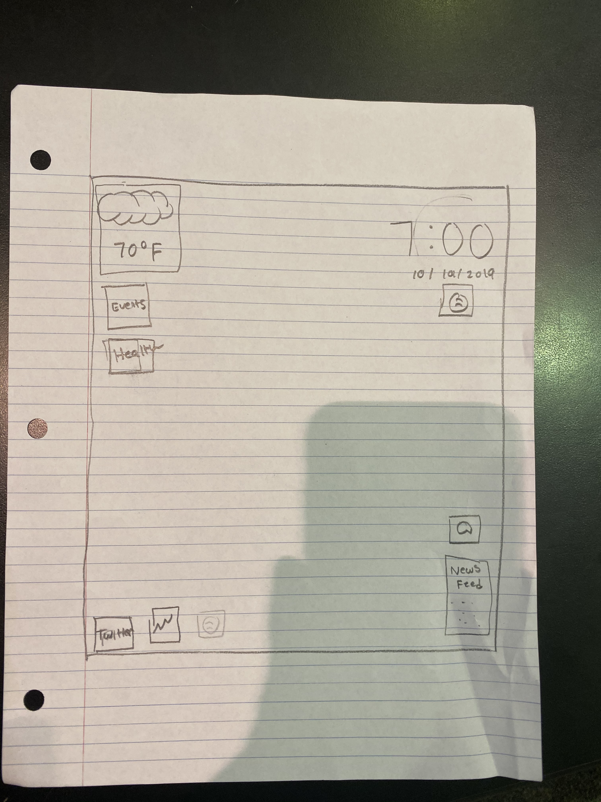

# Presentation

## Sketch

### Functions:

* General information
    * Clock (date and time)
    * Weather
    * Events calendar
    * Health
        * Sleep (length of sleep)
        * Weight/height
        * Exercise
        * Screen time
    * News feed
    * Messages (SMS)
* Other information
    * Stock market
    * Spotify player

## How far did you go with the implementation?
Met up twice to explore the different libraries we need to implement the project. We have also set up the GitHub organization along with the two repositories for the project (presentation, project implementation).

## Plan to move forward
We plan on meeting up at some point this week depending on how our schedule works to try to implement the basic layout.

## Team members
* Jason Mba - Basic layout, Health widget, Message (SMS)
* John Yucetas - Basic layout, Stock market widget, Events calendar
* Ukoh Ndukwo - Basic layout, Clock/date widget
* Pratik Patel - Basic layout, Weather widget
* Michael Kiros - Basic layout, News feed widget, Spotify

